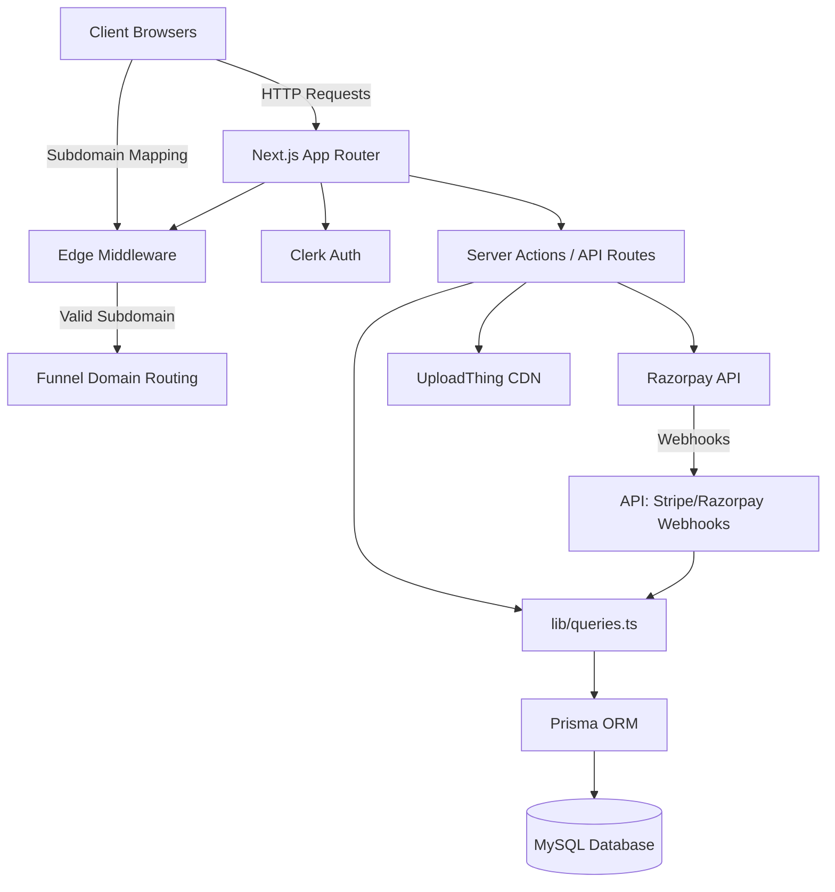

<div align="center">
  
  
  
  
  
</div>

<h1 align="center">Pyvra - B2B SaaS Website & Funnel Builder</h1>

<p align="center">
  A complete, multi-tenant B2B SaaS platform allowing agencies to manage their clients (subaccounts), build highly-customizable sales funnels, manage complex pipelines, and process payments entirely under a white-label brand.
</p>

---

### 2. Technology Highlight
*(A high-level overview of the technologies used)*

🔥 **A Full Stack Multi-Tenant SaaS App built with:** 
🟦 **Next.js (App Router, Server Actions)** 
🟡 **TypeScript** 
🟩 **Prisma ORM** 
🐬 **MySQL Database** 
🔐 **Clerk (Authentication)** 
🎨 **Tailwind CSS & Shadcn UI** 
💳 **Razorpay (Payments)** 
📁 **UploadThing (File Storage)**

---

### 3. 🚀 Project Overview

Pyvra is a comprehensive SaaS solution acting as a website and marketing funnel builder for Agencies. The project is modeled exactly after professional B2B white-labeling tools. 

Agencies can:
* Create unlimited customized **Subaccounts** for their business clients.
* Assign custom user permissions and invite team members.
* Build advanced **Funnels** with a drag-and-drop website editor.
* Map custom domains or subdomains to specific funnels dynamically.
* Manage fully functional **Pipelines** with Kanban-style drag-and-drop tickets.
* Monitor analytics through dashboards.
* Accept payments using an integrated **Razorpay** billing portal.

---

### 4. Detailed Project Architecture

This application adopts a modern Serverless architecture utilizing Next.js Server Components, Server Actions, and a decoupled Prisma Data Access Layer.

#### Architecture Diagram



#### Data Flow Explained
The application employs primarily two data flow patterns: Server Actions and Client Transitions.

1. **Standard Server Action Data Modification (e.g. Editing Pipeline Lane):**
   - **Client:** The React application passes validated form data via React Hook Form / Zod to a Next.js Server Action (`upsertLane`).
   - **Server (Action):** The Next.js backend receives the typed payload, and performs an authentication check via Clerk.
   - **Core Logic:** A database query is executed securely via `Prisma` querying the MySQL database.
   - **Revalidation:** Once saved, the server action automatically calls `revalidatePath` to clear the Next.js router cache, directly updating the UI for the user without making separate REST API requests.

2. **Custom Domain Multi-Tenant Routing (e.g. Viewing a Funnel):**
   - **Client:** A user goes to `client.your-agency.com`.
   - **Edge Middleware:** Next.js `middleware.ts` intercepts the request, reads the host header to identify the subdomain (`client`).
   - **Rewrites:** The middleware dynamically rewrites the incoming path to `src/app/[domain]/[path]/page.tsx`.
   - **Data Fetch:** The `[domain]` server component securely queries the database via Prisma to render the exact custom Funnel page constructed for that particular domain.

---

### 5. Key Features
*(A structural list of features based on the application layout)*

🔑 **Key Features (from File Structure)**

* `src/app/site`: **Public Landing Page** explaining the platform benefits and SaaS pricing cards.
* `src/app/(main)/agency`: **Agency Dashboard** - Central hub for agency owners to manage subaccounts, configure team members, handle global billing, and review total pipeline revenue.
* `src/app/(main)/subaccount`: **Client Interface** - The core workspace for a subaccount instance containing drag-and-drop Kanban pipelines, contact management, media storage, and automations setup.
* `src/app/[domain]`: **Multi-Tenant Routing Engine** - Next.js dynamic routes allowing unlimited custom funnel websites built via the platform to be hosted on dedicated subdomains seamlessly.
* `src/components/forms`: **Robust Form Interactions** - Pre-built forms using Zod schema validation for user invites, pipeline lane management, and agency configuration.
* `src/lib/razorpay`: **Integrated Payment Webhooks** - Endpoints securely capturing Razorpay updates to synchronize SaaS subscription active status instantly with the database.

---

### 6. 🧑‍💻 Tech Stack

| Layer | Technology Used |
| :--- | :--- |
| **Frontend Options** | Next.js (v15), React (v18), Tailwind CSS, Shadcn UI, Tremor, Lucide React, Pangea DnD |
| **Backend Methods**  | Next.js Server Components, Server Actions, Next.js API Routes |
| **Database Tooling** | MySQL (Database), Prisma (ORM) |
| **Authentication**   | Clerk |
| **Upload Storage**   | UploadThing |
| **Payment Gateway**  | Razorpay |
| **Forms/Validation** | React Hook Form, Zod |

---

### 7. 🚀 Getting Started / How to Run

Follow these instructions to get a copy of the project up and running on your local machine.

*Prerequisites:*
* **Node.js** (v18+)
* **MySQL Database** (Local or hosted via PlanetScale / AWS RDS)
* **Clerk Account** (For Authentication Keys)
* **UploadThing Account** (For Storage Keys)
* **Razorpay Account** (Optional, for payment sandbox mode)

#### Environment Setup

1. **Clone the repository:**
   ```bash
   git clone https://github.com/your-username/saas-pyvra.git
   cd saas-pyvra
   ```

2. **Install dependencies:**
   ```bash
   npm install
   ```

3. **Initialize Environment Variables:**
   Create a `.env` file in the root directory and populate it with the necessary keys (Database URL, Clerk, UploadThing, Razorpay configs). Reference `.env.example` if available.

4. **Initialize the Database:**
   ```bash
   npx prisma generate
   npx prisma db push
   ```

5. **Start the development server:**
   ```bash
   npm run dev
   ```

The application will be running on `http://localhost:3000`.

---

### 8. ✍️ Built By
This software is developed and managed for **Pyvra**.
